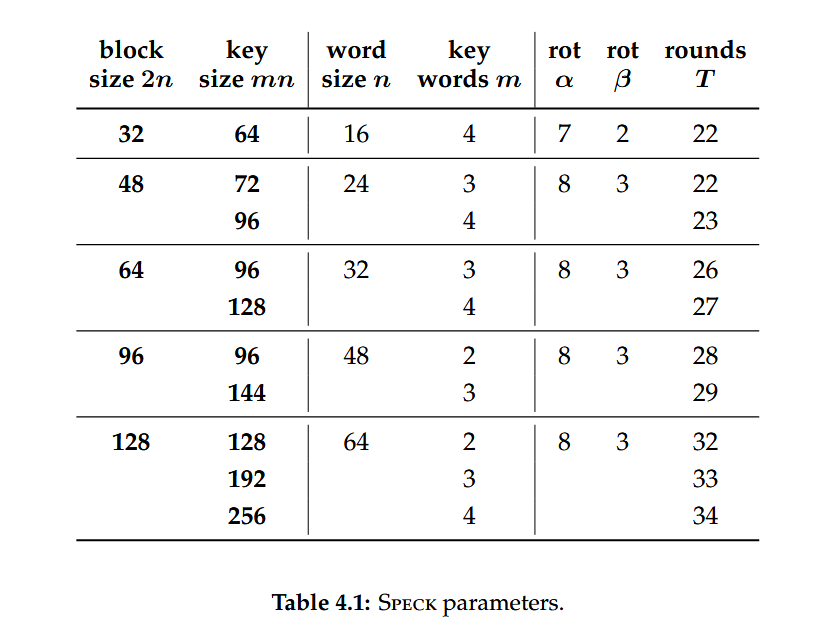
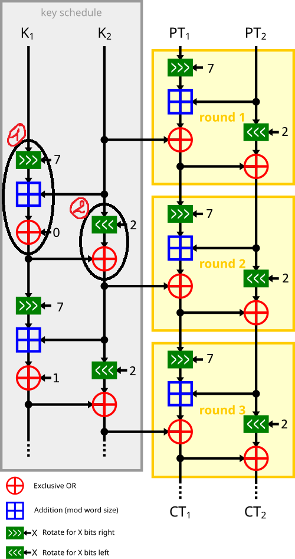

# Implémentation du Chiffrement Speck 32/64

Ce module propose une implémentation C++ de **Speck 32/64**, un chiffrement par bloc léger de la famille Simon & Speck.

## 1. Spécifications Techniques

Nous respectons strictement les standards définis pour la variante **Bloc 32 bits / Clé 64 bits**.

### Paramètres Choisis (Table 4.1 Standard)

| Paramètre | Valeur | Description |
| :--- | :---: | :--- |
| **Taille de Bloc ($2n$)** | **32 bits** | Traité comme 2 mots de 16 bits ($n=16$). |
| **Taille de Clé ($mn$)** | **64 bits** | Composée de 4 mots de 16 bits ($m=4$). |
| **Rotation $\alpha$** | **7** | Rotation circulaire vers la **droite** (sur $x$). |
| **Rotation $\beta$** | **2** | Rotation circulaire vers la **gauche** (sur $y$). |
| **Nombre de Tours ($T$)** | **22** | Standard officiel pour une sécurité maximale. |

> **Note :** Les constantes de rotation $\alpha=7$ et $\beta=2$ sont spécifiques à cette taille de bloc. (Voir capture du tableau des paramètres `SPECK_parameters.png` ci-dessous).



## 2. Architecture ARX (Add-Rotate-XOR)

Contrairement aux chiffrements de type SPN ou Feistel classique, Speck n'utilise **pas de S-Box**. La non-linéarité nécessaire à la sécurité repose sur l'opération d'**Addition Modulaire**.

La fonction de tour exécute les opérations suivantes sur des mots de 16 bits :

1.  **Rotation Droite** ($\ggg \alpha$) sur le mot de gauche.
2.  **Addition Modulaire** ($+$) : $x + y \pmod{2^{16}}$.
3.  **XOR avec la Clé** ($\oplus k_i$).
4.  **Rotation Gauche** ($\lll \beta$) sur le mot de droite.
5.  **XOR de Mélange** ($\oplus$) : $y \oplus x$.



## 3. Détails de l'Implémentation C++

### Key Schedule (Génération des Clés)
La clé maîtresse de 64 bits est étendue en 22 sous-clés (une par tour). L'algorithme de *Key Schedule* réutilise la fonction de tour pour mélanger la clé.

### Flexibilité pour la Cryptanalyse
Bien que le standard fixe le nombre de tours à 22, notre implémentation permet de configurer ce nombre dynamiquement via le constructeur :

```cpp
// Exemple : Instanciation d'un Speck réduit à 6 tours pour l'attaque
Speck cipher(master_key, 6);
```